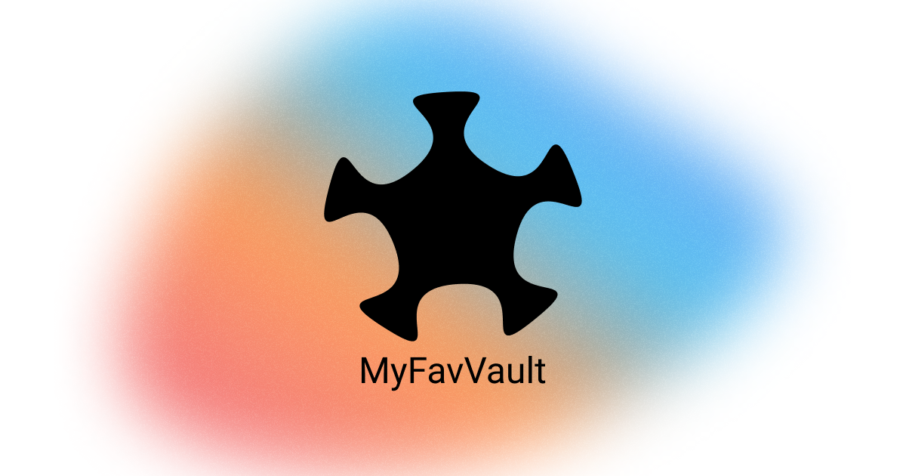

# MyFavVault



## Features

- Personalized profiles
- Discover new content
- Share with others

## Run Locally

Clone the project

```bash
  git clone https://github.com/Isl0m/my-fav-vault
```

Go to the project directory

```bash
  cd my-fav-vault
```

Install dependencies

```bash
  pnpm install
```

Start the server

```bash
  pnpm dev
```
